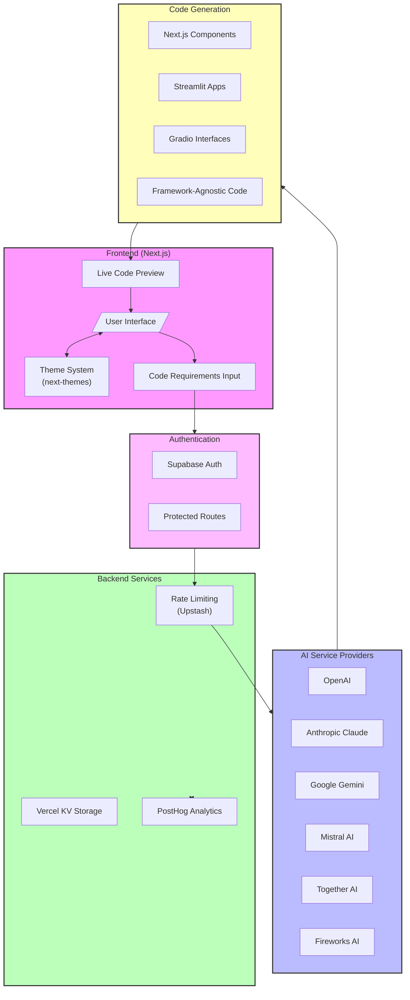

# AI Code Generator 🚀


Cogen AI is a powerful AI-driven development tool that revolutionizes the way developers create, test, and preview code snippets in real-time. Built with modern technologies and integrating multiple AI providers, it offers a seamless experience for developers across different frameworks and platforms.

## ✨ Features

### 🤖 AI-Powered Code Generation

- Real-time code generation and preview using AI providers:
- OpenAI: Leveraging GPT models for accurate code generation
- Anthropic: Claude models for sophisticated code understanding
- Google Gemini: Advanced code completion and suggestions
- Mistral AI: Fast and efficient code generation
- Together AI: Custom model implementations
- Fireworks AI: Specialized code optimization

### 🎭 Developer Personas

- Framework-specific code generation with tailored outputs:
- Streamlit: Auto-generation of data app components
- Gradio: ML model interface generation
- Next.js: React component and page generation
- Framework-agnostic: Universal code patterns
- Intelligent context awareness for framework-specific best practices
- Custom code templates for each framework

### 🎨 Advanced UI/UX Implementation

- Live code preview
- Dynamic theming system using next-themes
- Layouts with Tailwind CSS
- Custom dialogs for settings and configurations
- Dropdown menus for AI provider selection
- Tabs for organizing different code views
- Auto-resizing textarea for code input using react-textarea-autosize

### 🔒 Security & Performance Features

- Supabase authentication integration:
- User management and session handling
- Protected API routes
- Custom auth UI components
- Rate limiting implementation:
- Configurable request windows
- Maximum request limits
- Upstash KV storage for rate limit tracking
- Vercel KV for efficient data storage and retrieval

### 📊 Analytics Integration

- PostHog analytics implementation:
- User interaction tracking
- Feature usage metrics
- Custom event tracking
- Real-time analytics dashboard
- Configurable analytics enabling/disabling

## 🛠️ Tech Stack

### Frontend

```javascript
// Next.js App Router setup

import { AppProps } from "next/app";

import { ThemeProvider } from "next-themes";

function MyApp({ Component, pageProps }: AppProps) {
  return (
    <ThemeProvider attribute="class">
      <Component {...pageProps} />
    </ThemeProvider>
  );
}
```

```javascript
// AI Provider Configuration
import { OpenAI } from "@ai-sdk/openai";

import { Anthropic } from "@ai-sdk/anthropic";

import { Google } from "@ai-sdk/google";

const aiProviders = {
  openai: new OpenAI(process.env.OPENAI_API_KEY),

  anthropic: new Anthropic(process.env.ANTHROPIC_API_KEY),

  google: new Google(process.env.GOOGLE_AI_API_KEY),

  // Additional providers...
};
```

## 🛠️ Tech Stack

### Frontend

```javascript
// Next.js App Router setup import  {  AppProps  }  from  'next/app';
import { ThemeProvider } from "next-themes";
function MyApp({ Component, pageProps }: AppProps) {
  return (
    <ThemeProvider attribute="class">
      {" "}
      <Component {...pageProps} />{" "}
    </ThemeProvider>
  );
}
```

### AI Integration

```javascript

// AI Provider Configuration
import  {  OpenAI  }  from  '@ai-sdk/openai'; import  { Anthropic }  from  '@ai-sdk/anthropic';
import  {  Google  }  from  '@ai-sdk/google';
const aiProviders =  {
openai:  new  OpenAI(process.env.OPENAI_API_KEY),
anthropic: new Anthropic(process.env.ANTHROPIC_API_KEY),
google: new  Google(process.env.GOOGLE_AI_API_KEY),
// Additional providers...
};`

```

### Rate Limiting

```typescript
// Rate Limiting Configuration
import { Ratelimit } from "@upstash/ratelimit";
import { kv } from "@vercel/kv";
const ratelimit = new Ratelimit({
  redis: kv,
  limiter: Ratelimit.slidingWindow(
    process.env.RATE_LIMIT_MAX_REQUESTS,
    process.env.RATE_LIMIT_WINDOW
  ),
});
```

### High Level Architecture



## 🚀 Getting Started

Clone the repository:

```bash
git clone https://github.com/yourusername/code-capsule.git
```

Install dependencies:

```bash
`npm  install
# or
yarn  install
```

Configure environment variables:

```bash
`cp .env.example .env.local`
```

Start the development server:

```bash
`npm run dev # or yarn dev`
```

## 🔑 Environment Variables

Create a `.env.local` file with the following variables:

```
`# E2B API Configuration
E2B_API_KEY=your_e2b_api_key

# AI Provider API Keys
ANTHROPIC_API_KEY=your_anthropic_key
OPENAI_API_KEY=your_openai_key
GROQ_API_KEY=your_groq_key
FIREWORKS_API_KEY=your_fireworks_key
TOGETHER_AI_API_KEY=your_together_ai_key
GOOGLE_AI_API_KEY=your_google_ai_key
GOOGLE_GENERATIVE_AI_API_KEY=your_google_gen_ai_key
MISTRAL_API_KEY=your_mistral_key

# Optional Configuration
NEXT_PUBLIC_SITE_URL=your_site_domain

# API Configuration Options
NEXT_PUBLIC_NO_API_KEY_INPUT=true_or_false NEXT_PUBLIC_NO_BASE_URL_INPUT=true_or_false

# Rate Limiting
RATE_LIMIT_MAX_REQUESTS=your_max_requests RATE_LIMIT_WINDOW=your_window_in_seconds

# Vercel/Upstash KV Configuration
KV_URL=your_kv_url KV_REST_API_URL=your_kv_rest_api_url KV_REST_API_TOKEN=your_kv_rest_api_token KV_REST_API_READ_ONLY_TOKEN=your_read_only_token

# Supabase Configuration
NEXT_PUBLIC_ENABLE_SUPABASE=false NEXT_PUBLIC_SUPABASE_URL=your_supabase_url NEXT_PUBLIC_SUPABASE_ANON_KEY=your_supabase_anon_key

# PostHog Configuration
NEXT_PUBLIC_ENABLE_POSTHOG=true
NEXT_PUBLIC_POSTHOG_KEY=your_posthog_key NEXT_PUBLIC_POSTHOG_HOST=your_posthog_host`

----------
```

Built with Next.js, AI, and modern web technologies
